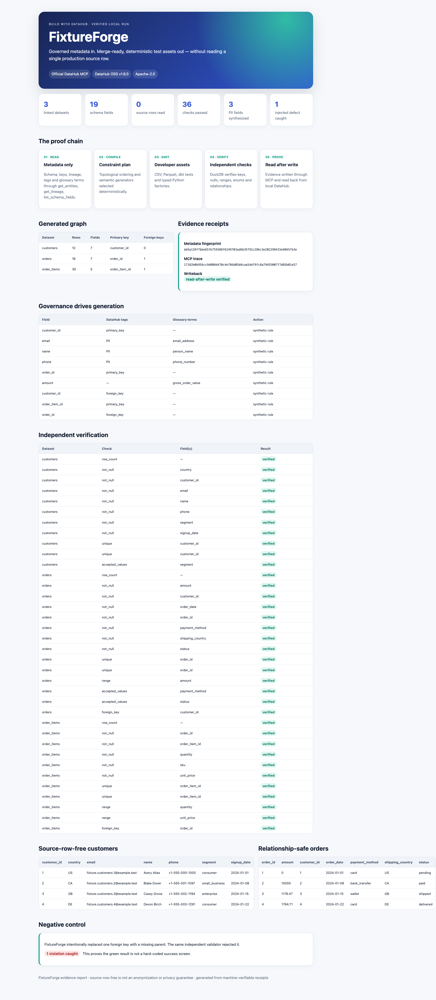

# FixtureForge

FixtureForge compiles governed DataHub metadata into deterministic, merge-ready
test assets without reading production source rows.

It turns schemas, primary and foreign keys, lineage, tags, glossary terms, and
explicit test policies into:

- linked CSV and Parquet fixtures;
- dbt schema tests;
- typed Python accessors;
- valid boundary examples and an intentionally broken negative control;
- a machine-verifiable evidence manifest; and
- a self-contained visual report for reviewers.

FixtureForge is a new Apache-2.0 project for the Build with DataHub hackathon,
entered in Metadata-Aware Code Generation & Development.

## Demo

- [Submitted Devpost project](https://devpost.com/software/fixtureforge)
- [Public 2:27 demonstration video](https://youtu.be/nVfAAvWDKyQ)
- [Public source repository](https://github.com/Oxygen56/fixtureforge)

## The problem

Data developers need representative fixtures before a pipeline is ready. Copying
production rows is fast, but it creates privacy, access, and reproducibility
risk. Hand-written fixtures avoid the copy but drift away from schemas,
relationships, and governance rules.

FixtureForge treats DataHub metadata as the test-data specification.

## What makes the proof credible

The judge path uses a real local DataHub OSS v1.6.0 instance and the official
DataHub MCP Server. The server is started over stdio with mutation disabled
during collection. FixtureForge allowlists three tools:

- get_entities;
- list_schema_fields; and
- get_lineage.

There is no source-row tool in the adapter. Every MCP request and response is
recorded, hashed, and cited in the output manifest.

After generation, DuckDB independently checks row counts, nullability,
uniqueness, ranges, accepted values, and foreign keys. FixtureForge then breaks
one foreign key on purpose and proves that the same verifier rejects it.

## Architecture

    DataHub OSS
        |
        | official MCP: schema, keys, lineage, tags, terms
        v
    normalized contract + explicit test policy
        |
        v
    deterministic constraint compiler
        |
        +--> CSV and Parquet
        +--> dbt tests
        +--> typed factories
        +--> provenance manifest
        |
        v
    independent DuckDB verifier
        |
        +--> valid bundle passes
        +--> broken foreign key fails
        |
        v
    approval-gated local MCP writeback + read-after-write receipt

## Quick start

Requirements: Docker, uv, and about 6 GB of free memory for the DataHub
quickstart stack.

Install dependencies:

    make sync

Start DataHub:

    make datahub

If port 8080 is already occupied:

    DATAHUB_MAPPED_GMS_PORT=18080 make datahub

Run the complete judge demonstration in another terminal:

    DATAHUB_GMS_URL=http://localhost:8080 make judge

For the alternate port:

    DATAHUB_GMS_URL=http://localhost:18080 make judge

Open build/live-demo/evidence-report.html when the run completes. The report is
self-contained and needs no server.

## Fast offline replay

The compiler can be evaluated without Docker using the committed normalized
fictional contract:

    uv run fixtureforge generate \
      --input fixtures/fiction_retail.metadata.json \
      --output build/demo \
      --seed 2026

    uv run fixtureforge verify --bundle build/demo

This replay proves compiler behavior but is not presented as live MCP evidence.

## Outputs

Review the [committed verified sample bundle](examples/verified-output) without
running the project first.

| Path | Purpose |
|---|---|
| valid/csv | deterministic relational fixtures |
| valid/parquet | compressed fixtures for analytical pipelines |
| developer/schema.yml | dbt-compatible tests and governance metadata |
| developer/factories.py | typed fixture loader |
| negative/broken_foreign_key | a deliberate failure case |
| evidence/validation.json | independent check results |
| evidence/negative-validation.json | proof that the failure was caught |
| evidence/manifest.json | file hashes, provenance, rules, and claim boundary |
| evidence-report.html | visual judge report |

## Reproducibility

The same metadata, test policy, FixtureForge version, and seed produce
byte-identical outputs. The judge script performs two independent builds and
compares every emitted file hash.

The current test suite includes unit, integration, property, negative-control,
and report tests. Core coverage is enforced at 90 percent; the verified local
run currently exceeds that threshold.

## Security model

- Read-only MCP collection is the default.
- Tool names are allowlisted.
- DataHub mutation is disabled during collection.
- Writeback is a separate command, restricted to localhost.
- Writeback requires the explicit approve-local-writeback flag.
- Evidence is read back after mutation before success is reported.

## Honest boundaries

Source-row-free means FixtureForge does not inspect or copy production rows.
It does not mean anonymous, privacy-safe, differentially private, compliant, or
production-ready. Metadata can itself be sensitive or wrong and must still be
reviewed.

The committed demo uses an entirely fictional retail schema. No production row
was used to build or test this project.

## Development

    make test
    make lint

See CONTRIBUTING.md, SECURITY.md, docs/evidence-policy.md, and
THIRD_PARTY_NOTICES.md.

## License

Apache License 2.0.
